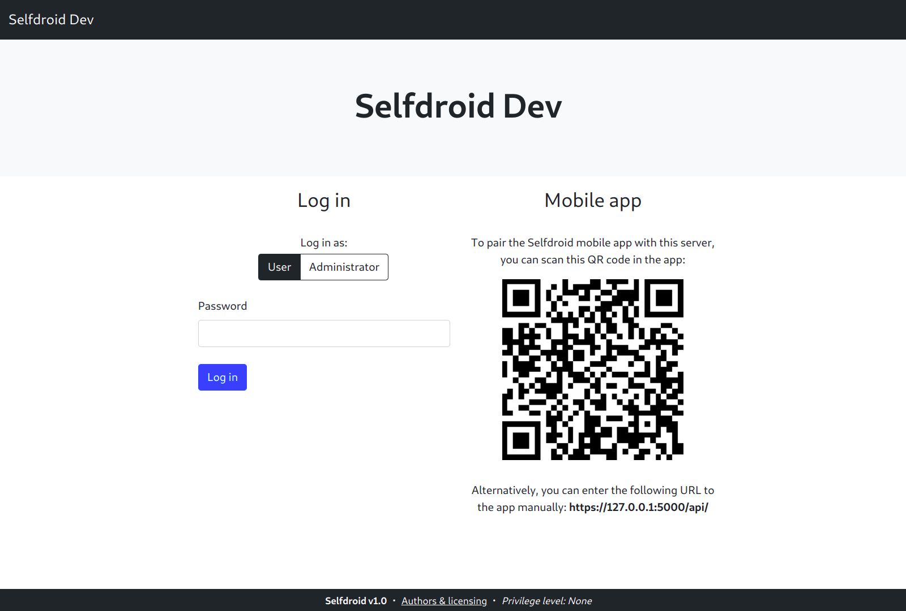
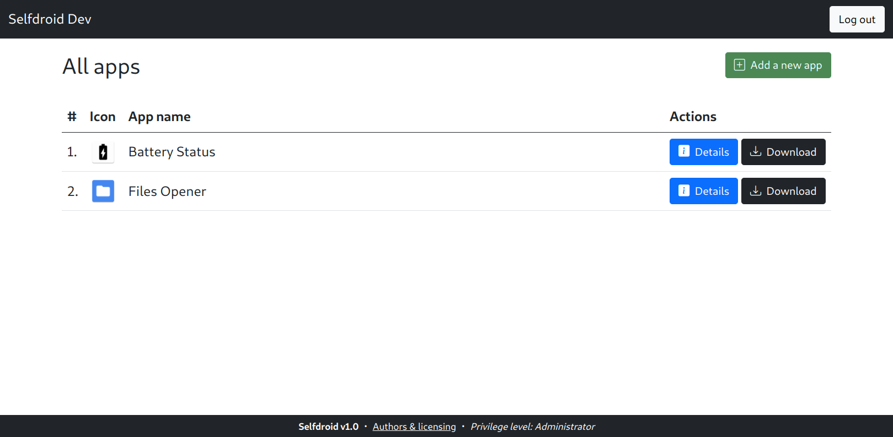
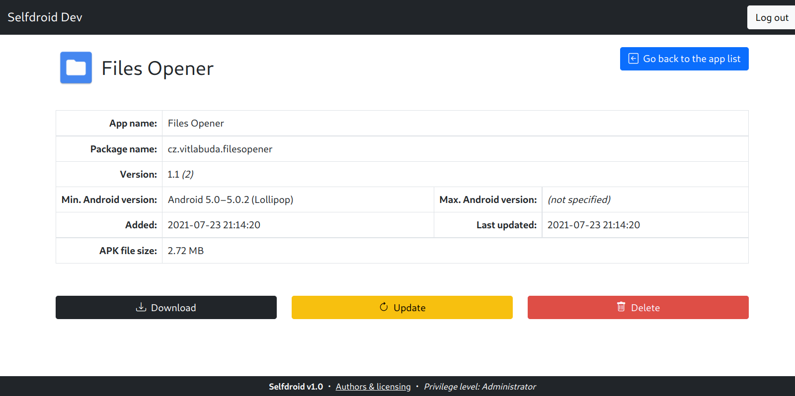

# Selfdroid Web App
**Selfdroid** is an open-source **self-hosted Android app store** written in Python 3 using the Flask framework.

This web app allows one to upload Android apps (in the form of APK files) to their own server and then deploy them to Android devices using the [Selfdroid Android app](#android-app).

It's intended primarily for those who want to conveniently distribute their own apps only to a relatively small amount of devices (e.g. within a company or a household) and therefore don't want to pay for a Google Play Developer account.


## Features and characteristics
- automatic app metadata (e.g. name, version, icon) extraction from APK files
- privilege separation – user- and administrator-level access
    - user – can view and download apps (with optional password protection)
    - administrator – can add, update and delete apps (with mandatory password protection)
- responsive web interface
- backward- and forward-compatible JSON API
- [atomic and consistent backend app storage](src/selfdroid/appstorage/NOTES)


## Android app
**The Android app, which will offer the abilities to conveniently install and update uploaded apps, is currently work-in-progress!** 


## Screenshots
<p float="left">
    
    
    
</p>


## Deployment & usage

### 1. Requirements
   * **Linux**
   * **Python 3.7+**

   The program was tested in Python 3.7 (Debian 10), Python 3.8 (Ubuntu 20.04) and Python 3.9 (Debian 11).


### 2. Install the dependencies
   On Debian/Ubuntu and their derivatives, execute the following:
   ```
   sudo apt update 
   sudo apt install python3 python3-pip python3-venv python3-virtualenv virtualenv uwsgi-core uwsgi-plugin-python3
   ```


### 3. Change the configuration to fit your needs
   The app's configuration can be altered in the **[Settings.py](src/selfdroid/Settings.py)** file.

   **One must configure the user and administrator password in the settings file before deploying the app!**


### 4. Prepare the environment
   The bash script [prepare.sh](src/prepare.sh) will do it for you:
   ```
   ./prepare.sh
   ```


### 5. Start the Flask app
   To start the web app using the Flask's built-in development server, use the [run_dev_server.sh](src/run_dev_server.sh) bash script:
   ```
   ./run_dev_server.sh
   ```

   To run the app in a production environment, [hook it to a web server](https://flask.palletsprojects.com/en/latest/deploying/) using an appropriate interface.
   The web app already comes with the following files to help you out with this:
   - [uwsgi.ini](src/uwsgi.ini) – uWSGI configuration file
   - [run_uwsgi.sh](src/run_uwsgi.sh) – uWSGI startup helper script
   - [selfdroid_uwsgi.service](selfdroid_uwsgi.service) – uWSGI systemd service (to run the web app on startup)
   - [selfdroid_nginx_vhost.conf](selfdroid_nginx_vhost.conf) – virtual host configuration file for the nginx web server


## Licensing
This project is licensed under the **3-clause BSD license**. See the [LICENSE](LICENSE) file for details.

In addition, this project uses some third-party open-source components. See the [BACKEND-THIRD-PARTY-LICENSES](BACKEND-THIRD-PARTY-LICENSES) and [FRONTEND-THIRD-PARTY-LICENSES](FRONTEND-THIRD-PARTY-LICENSES) files for details.  

Written by **[Vít Labuda](https://vitlabuda.cz/)**.
